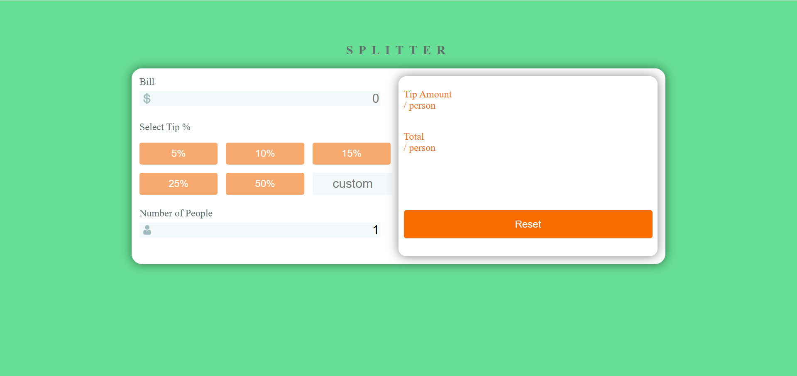
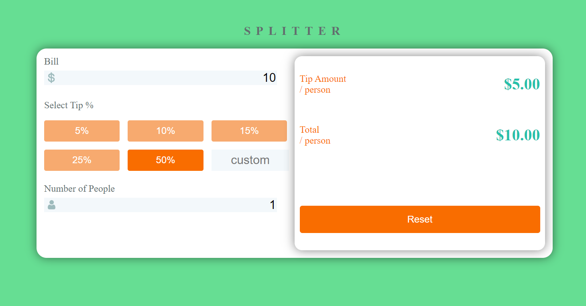
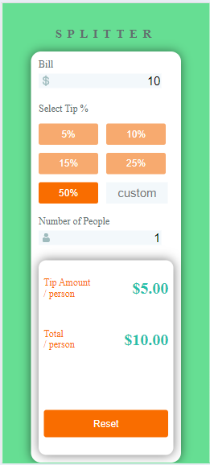

# Tip Calculator

## For Web

## For Mobile

This is a simple tip calculator web application built using HTML, CSS, and JavaScript.

## Features

- Calculate tip based on the bill amount and tip percentage entered by the user.
- Display the calculated tip amount and total bill amount including the tip.
- Provides validation to ensure that the user inputs valid numbers for the bill amount and tip percentage.

## Usage

1. Open the `index.html` file in a web browser.
2. Enter the bill amount in dollars ($) in the "Bill Amount" input field.
3. Enter the tip percentage (%) in the "Tip Percentage" input field.
4. Click the "Calculate Tip" button.
5. The calculated tip amount and total bill amount including the tip will be displayed below.

## Files

- `index.html`: The main HTML file containing the structure of the web application.
- `styles.css`: The CSS file containing the styles for the web application.
- `script.js`: The JavaScript file containing the logic for calculating the tip.

## Installation

You can run this project locally on your machine by following these simple steps:

1. **Clone the repository:**

   git clone [https://github.com/yourusername/tip-calculator.git](https://github.com/SHIVanshuSingh07/Tip-Calculator)
2. **Navigate to the project directory:**
   
     cd tip-calculator
   
4. **Open index.html in your web browser:**
   
     Right-click on the index.html file.
   
     Choose "Open with" and select your preferred web browser.

